<div align="center">

# 🌱 Silent Voice
### An Accessible AAC Communication App, Built on a Real On-Device Computer Vision Pipeline

A communication tool for nonverbal and speech-impaired users — text, voice, pictures, and sign language, all in one interface — wrapped in a gamified "garden" that grows as you communicate, so progress feels like progress, not therapy homework.


## 📁 Project Structure

```
src/
├── App.jsx                  # All screens + router. Single-file for now —
│                             # a production refactor would split each screen
│                             # into its own component file.
└── sign/
    ├── landmarks.js          # MediaPipe Face+Pose+Hand Landmarker pipeline
    ├── signModel.js          # TFLite model loading + per-frame inference
    └── useSignDetector.js    # Timed capture hook with warm-up + retry logic
public/
├── model.tflite
├── sign_to_prediction_index_map.json
└── avatars/
    ├── boy.png
    └── girl.png
```


## Why This Exists

Most AAC (Augmentative and Alternative Communication) tools are clinical, gray, and built for compliance — not joy. Silent Voice keeps the same core function — turning input into spoken output — but wraps it around a companion character ("Luma") and a garden that grows with every phrase spoken, so the experience feels like play, not a medical device.

This project was also my way of going past tutorial-level React and tackling a problem I hadn't solved before: getting real computer vision and ML inference to run **entirely on-device, inside a browser** — no backend, no API calls, no sending a user's camera feed anywhere.

## 🎯 What This Project Demonstrates

| Area | Where to see it |
|---|---|
| On-device ML inference (TFLite + WASM) in the browser | [`signModel.js`](src/sign/signModel.js), Deep Dive #2–#4 |
| Real-time computer vision pipelines (MediaPipe Landmarkers) | [`landmarks.js`](src/sign/landmarks.js) |
| Debugging async/race conditions in custom React hooks | [`useSignDetector.js`](src/sign/useSignDetector.js), Deep Dive #1 |
| Reading runtime/WASM errors to diagnose a model's real input contract | Deep Dive #3 |
| Recognizing an unfixable architectural dead end and re-scoping rather than shipping something broken | Deep Dive #4 |
| Accessibility-first UI design (not just visual polish) | Settings panel — reduced motion, high contrast, dyslexia-friendly spacing, adjustable touch targets |
| Honest technical writing — this README documents what doesn't work yet, not just what does | [Known Limitations](#️-known-limitations) |

## 📸 Screenshots

<table>
<tr>
<td>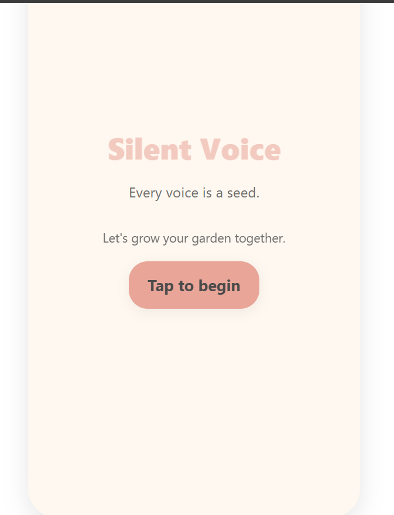</td>
<td>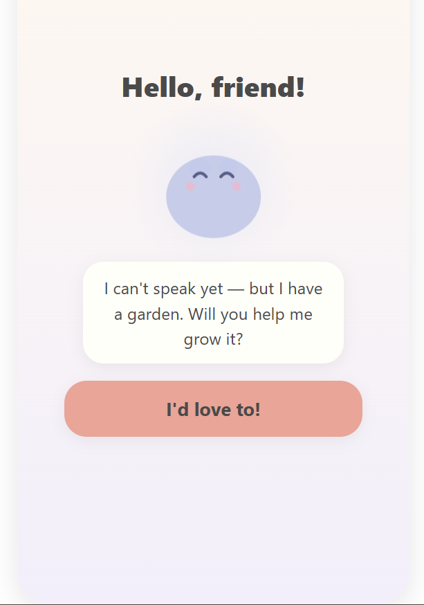</td>
<td>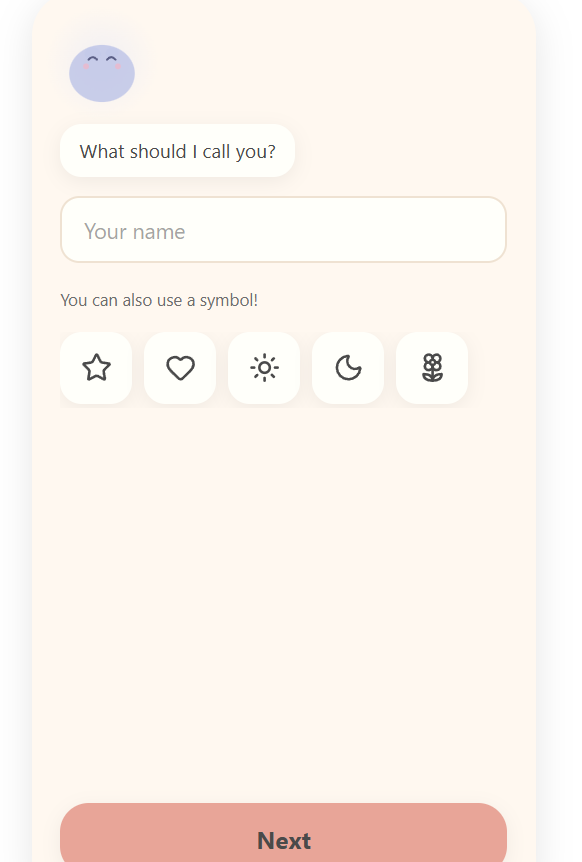</td>
</tr>
<tr>
<td>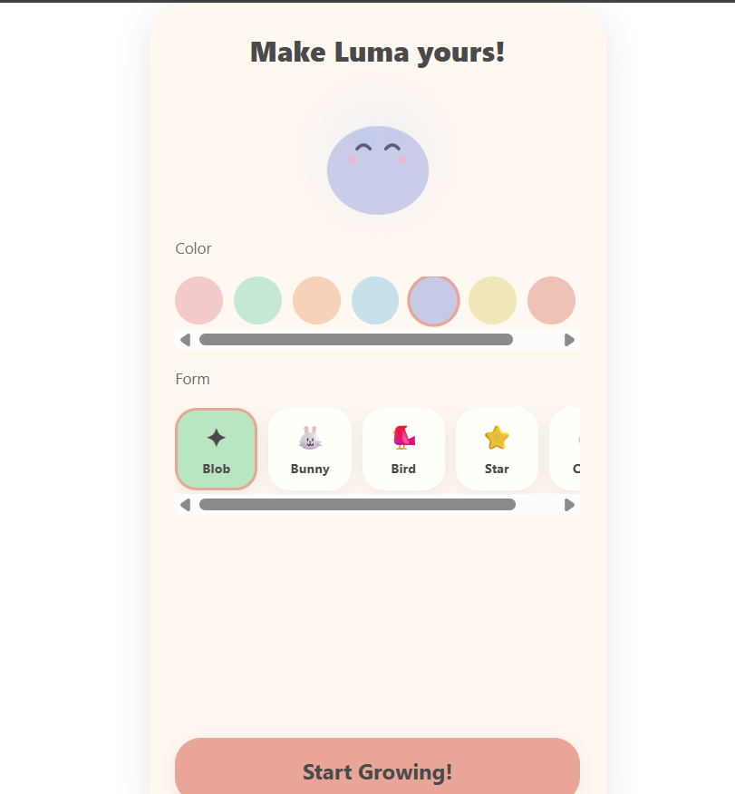</td>
<td>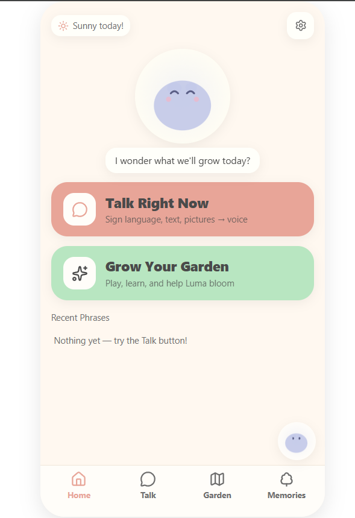</td>
<td>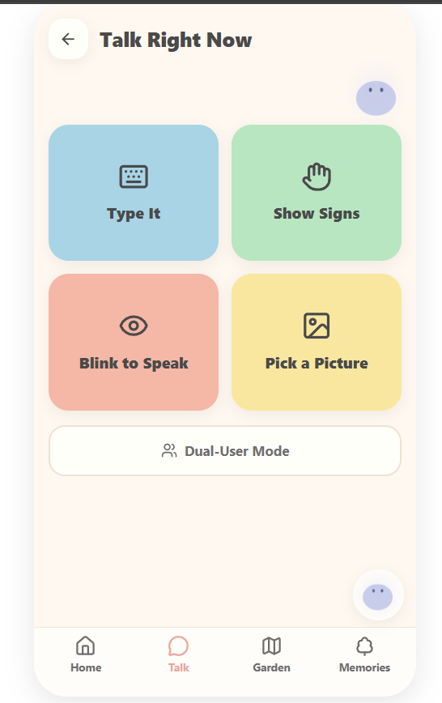</td>
</tr>
<tr>
<td>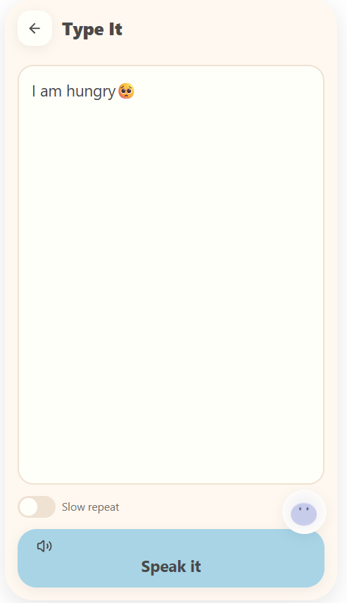</td>
<td>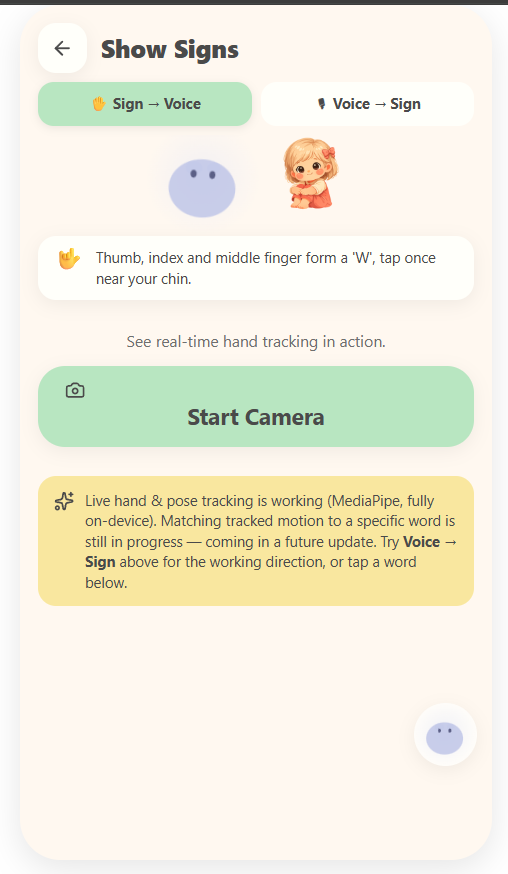</td>
<td>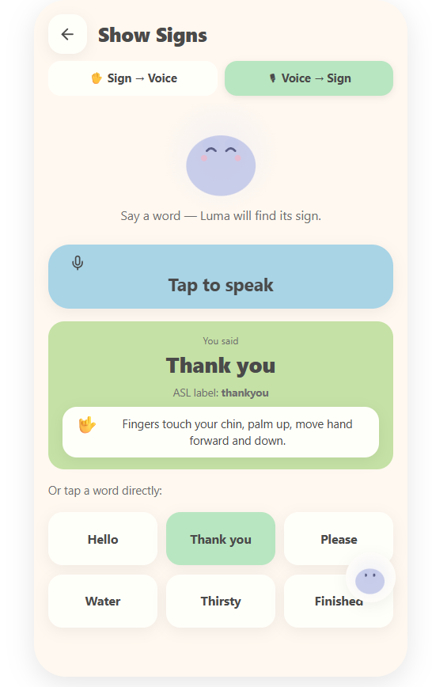</td>
</tr>
<tr>
<td>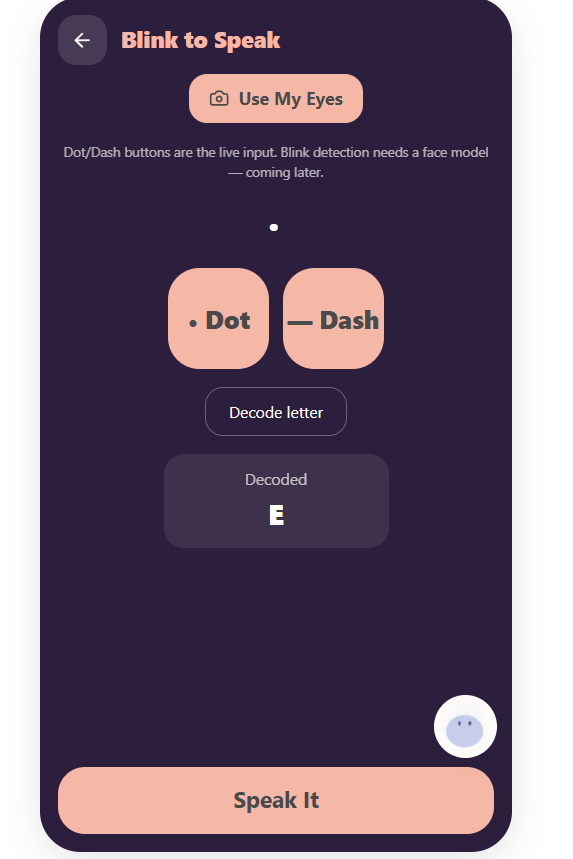</td>
<td>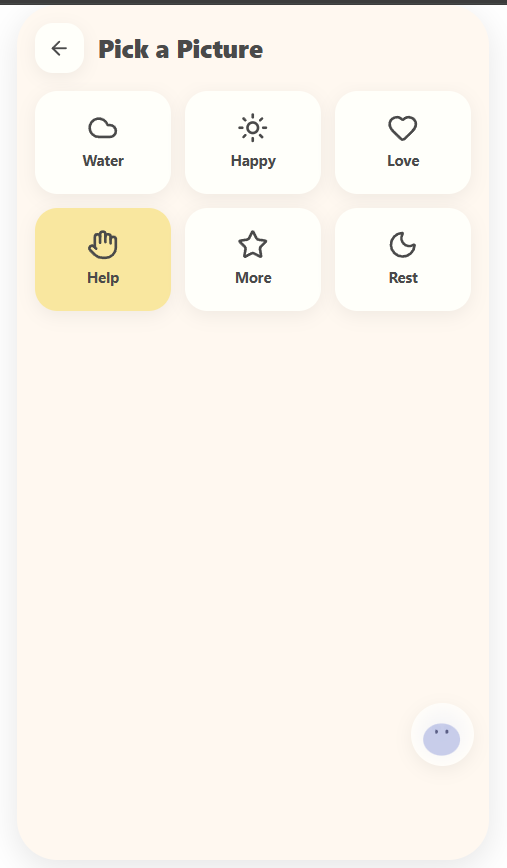</td>
<td>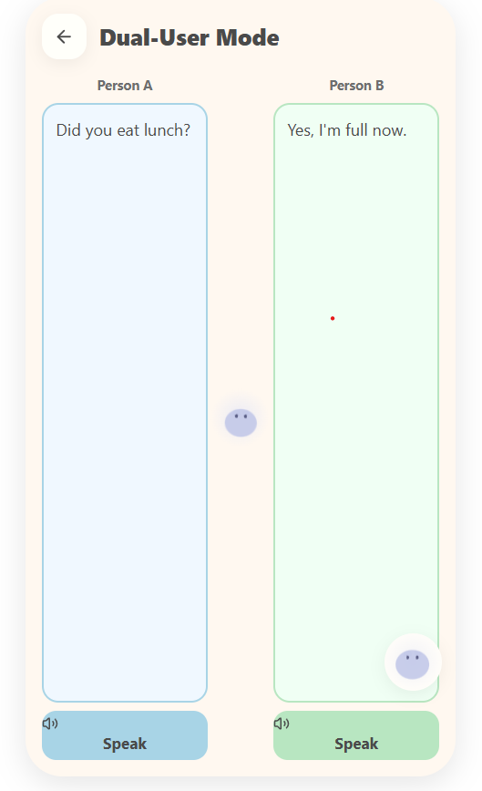</td>
</tr>
<tr>
<td>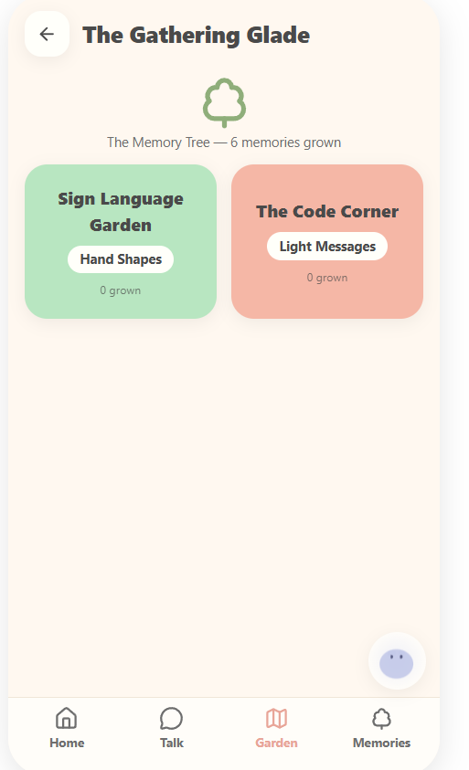</td>
<td>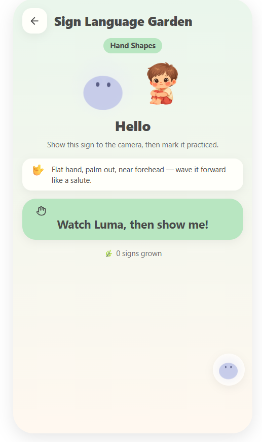</td>
<td>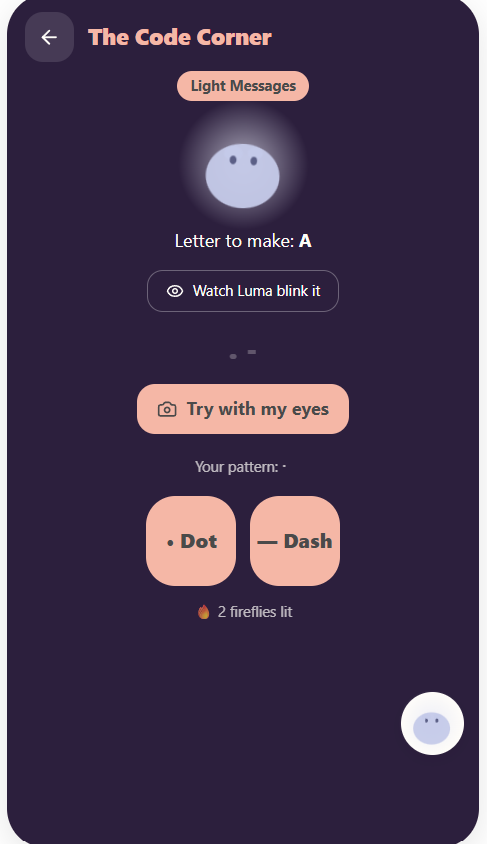</td>
</tr>
<tr>
<td>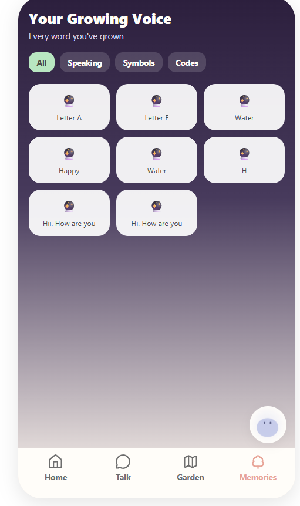</td>
<td>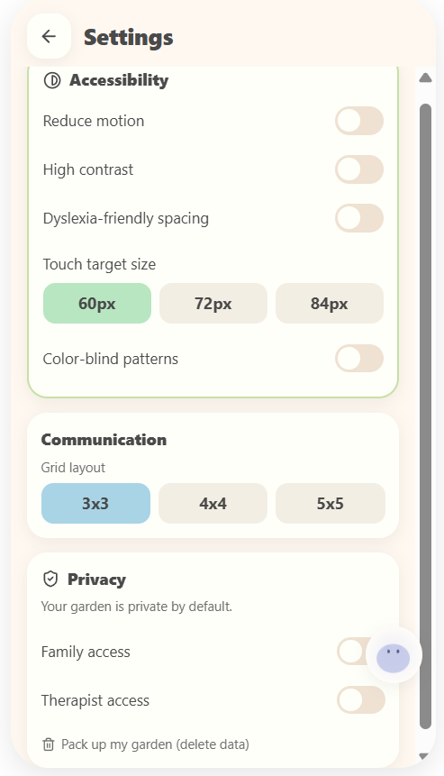</td>
<td></td>
</tr>
</table>

*(Onboarding, the Talk hub, sign-language tools, accessibility settings, and the memory tree.)*

## ✨ Features

| Feature | Status |
|---|---|
| Type → Voice (text-to-speech, slow-repeat mode) | ✅ Working |
| Voice → Sign (Web Speech API → ASL label lookup) | ✅ Working |
| Pick a Picture (symbol board) | ✅ Working |
| Dual-User Mode (face-to-face conversation aid) | ✅ Working |
| Sign Language Garden (gamified practice, on-device hand/pose tracking) | ✅ Built · ⏳ Auto-grading in progress |
| Sign → Voice (camera reads a sign, speaks the word) | ⏳ Blocked — see Deep Dive #4 |
| Blink to Speak / Code Corner (morse, manual input) | ✅ Working as manual input · ⏳ Real blink detection planned |
| Accessibility settings (reduced motion, high contrast, dyslexia spacing, adjustable touch targets, color-blind patterns) | ✅ Working |
| Memory Tree (history of every phrase spoken) | ✅ Working |
| Custom companion ("Luma" — 5 forms, 8 colors) + cartoon avatar companions | ✅ Working |

## 🏗️ Architecture

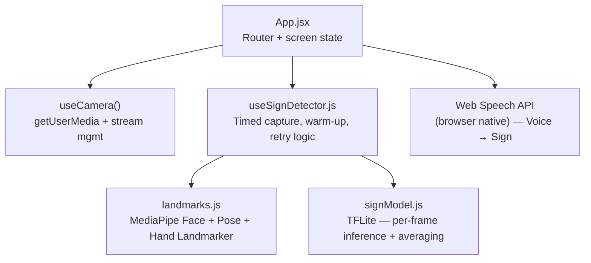

`useCamera`, `useSignDetector`, and the Web Speech API are independent siblings off `App.jsx` — they don't feed into each other. Only `landmarks.js` and `signModel.js` sit inside the sign-detection pipeline.

## 🐛 Engineering Deep Dive: Bugs Fixed

The core challenge of this project was getting real, on-device computer vision (MediaPipe + TFLite) working inside a browser — not a trivial integration. Logged here because the dead ends taught more than the easy parts did.

**1. "Too few frames captured" on every detection attempt**
MediaPipe's first inference call is slow (model/WASM warm-up), and that warm-up was happening *inside* the 1.2s timed capture window — eating most of the budget before a single usable frame landed. Fixed by running one untimed warm-up frame before starting the clock, and letting the window extend up to 2.5s on slower devices instead of failing outright.

**2. `Can't initialize model` (TFLite)**
Looked like a model-format problem at first. It wasn't — `model.tflite` simply didn't exist anywhere in the project. Vite's dev server falls back to serving `index.html` for any unmatched path, so the loader was silently trying to parse an HTML page as a TFLite flatbuffer. Confirmed by checking the file's magic bytes (`TFL3` should appear at byte offset 4 in a real `.tflite` file) and finding nothing there at all.

**3. `Input tensor shape mismatch: expect '1,543,3', got '1,8,543,3'`**
Assumed the model accepted a whole sequence of frames as one batch (a time axis). It doesn't — confirmed directly from the runtime's own error message, the model wants exactly one landmark frame per call, shape `(1, 543, 3)`. Fixed by calling `predict()` once per captured frame and averaging the resulting class probabilities in JS, instead of batching frames into the model.

**4. `WASM Aborted()` on every single frame, even with the correct shape — architectural dead end**
Not a code bug. The downloaded model (a public Kaggle Isolated Sign Language Recognition submission — 543-point MediaPipe Holistic landmarks, 250 classes) almost certainly embeds `SELECT_TF_OPS` ("Flex" ops) for its internal feature engineering — ops the in-browser TFLite WASM runtime doesn't implement. No JS-side fix exists for a C++ runtime abort. Rather than fake a working feature, the UI was changed to be upfront about it: the Sign Language Garden became a self-paced practice flow instead of auto-graded, with a custom hand-only classifier listed as a roadmap item instead of a broken button.

**5. Dual-User Mode panels overflowing the card on the right**
Two `flex: 1` text panels with padding and borders, no `box-sizing: border-box` set anywhere in the app — the browser default (`content-box`) adds padding/border *on top of* the flex-allocated width instead of inside it, so the rightmost panel had nowhere to go but past the edge. Fixed with a scoped `box-sizing: border-box` reset, plus `min-width: 0` on each flex column (flex items default to `min-width: auto`, which blocks them from shrinking below their content size on narrow viewports).

## ⚠️ Known Limitations

- **Camera → word matching isn't live yet.** A working MediaPipe landmark-detection pipeline (Face/Pose/Hand) was built and verified during debugging — see Deep Dive #1–#4 — but after removing the incompatible classifier, it's no longer wired into the camera UI. Re-connecting it (ideally with a live landmark overlay) is the first roadmap item. **Voice → Sign and the tap-a-word fallback are the fully working directions today.**
- Blink to Speak and Code Corner are manual-input learning tools, not yet wired to real blink/face detection.
- Sign Language Garden progress is self-reported ("I practiced this!") rather than auto-verified, until a custom gesture classifier replaces the incompatible downloaded one.

## 🗺️ Roadmap

- [ ] Re-wire the existing MediaPipe pipeline into the camera view with a live landmark overlay (proves tracking works visually, no classifier needed for this part)
- [ ] Train a lightweight, hand-only gesture classifier for the target words, exported to **tfjs** format instead of TFLite — sidesteps the browser op-support problem entirely
- [ ] Real blink-pattern detection for Blink to Speak, using MediaPipe Face Landmarker blendshapes
- [ ] Live sync for Dual-User Mode across two devices
- [ ] Expand the sign vocabulary past the initial word set

## 🛠️ Tech Stack

**Frontend:** React · Vite
**Computer Vision:** `@mediapipe/tasks-vision` (Face / Pose / Hand Landmarker)
**ML Inference:** TensorFlow Lite Web (`tfjs` + `tfjs-tflite`)
**Speech:** Web Speech API (`SpeechSynthesis` + `SpeechRecognition`)
**UI:** `lucide-react`

## 🚀 Quick Start

```bash
git clone https://github.com/DonaRashmitha-dev/The-Silent-Voice.git
cd The-Silent-Voice
npm install
npm run dev
```

Open the printed `localhost` URL in **Chrome** (camera permissions on `localhost` are inconsistent in some other Chromium-based browsers, e.g. Edge's Tracking Prevention).

`model.tflite` and `sign_to_prediction_index_map.json` already ship inside `public/` for the upcoming gesture classifier (see Roadmap) — they aren't required to run the current build.

